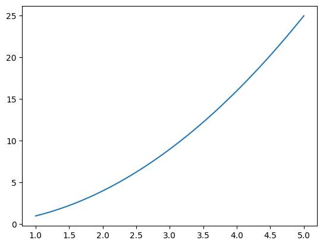

# Derivatives explained

## Functions

Before diving into derivatives, let's understand **function**.

**_Function is any expression which takes input and generates output._**

Example, $f(x) = x^2$

so, this function takes $x$ as input, and generates output. like, $f(2) = 2^2 = 4$

## Derivatives

**derivative is nothing but slope of function at any point** $x$

Plotting function $f(x) = x^2$ on graph

```python
import numpy as np
import matplotlib.pyplot as plt

# function
def f(x):
    return x**2

Xs = np.linspace(1,5,100)
Ys = f(Xs)

# plot function
plt.plot(Xs, Ys)

```

Output :



Derivatives gives us value of slope of function for that $x$ value. Meaning, how function's output changes when we slightly nudge $x$

Let's understand by considering example $x = 2$ for function $f(x) = x^2$

So, we know, when $x = 2$, $f(x) = 4$

Let's say, we increase $x$ by $a$ $(a = 0.001)$ , so, function becomes $f(x + a)$

So, $$f(x + a) = f(2 + 0.001) = f(2.001) = 2.001^2 = 4.0040$$

So, if we want to know _slope_ of $f(x)$ for $x = 2$, we use

$$ slope = \frac{f(x + a) - f(x)}{a} $$

$$ slope = \frac{4.0040 - 4}{0.001} $$

$$ slope = \frac{0.004}{0.001} $$

$$ slope = 4 $$

Let's understand how $slope = 4$ gives us information about how function's output changes when we slightly nudge input $x$

from above example,

for $x = 2$,  
derivative or slope of $f(x) = 4$

And when we slightly nudge $x$ towards positive side by a $(a = 0.001)$

i.e

$$x = x + a$$

$$ x = 2 + 0.001$$

for $x = x + a$  
function $f(x + a) = (x + a)^2$ outputs : $4.0040$

if we consider the difference between $f(x + a)$ & $f(x)$

$$= 4.0040 - 4$$

$$ = 0.004$$

difference is $0.004$ which is equals to $slope \times a$

$$4 \times 0.001 = 0.004$$

where $slope = 4$ & $a = 0.001$

So, we get to know that slope or derivative of function tells -

If input $x$ is slightly nudged by $a$, output of function changes by $slope \times a$

- If slope or derivative is positive, then function's output increases by $slope \times a$
- If slope or derivative is negative, then function's output decreases by $slope \times a$

## How differentiation helps to find slope of function

This slope gives us information about how function's output changes when we slightly increase $x$

This same information is given by differentiating a function

That is, if we differentiate function $f(x) = x^2$,

we get, $2x$

Now, if we put $x = 2$ in $2x$, we get $4$

**So, differentiating a function, gives a equation $(2x)$ which is used to find slope or derivative of that function at any point** $x$

Like, differentiating $f(x)$ gives us equation $2x$ which allows us to find slope of $f(x)$ at any point $x$

Slope is nothing but rate of change of function's output for particular $x$

### derivatives of function

For different values of $x$, function have different derivatives

That is,

**For each value of $x$, function has different derivative or slope.**

Example, for function $f(x) = x^2$ ,

- At $x = 2$, derivative or slope is $2x = 2 \times 2 = 4$

- At $x = 3$ , derivative or slope is $2x = 2 \times 3 = 6$

- At $x = 4$, derivative or slope is $2x = 2 \times 4 = 8$
