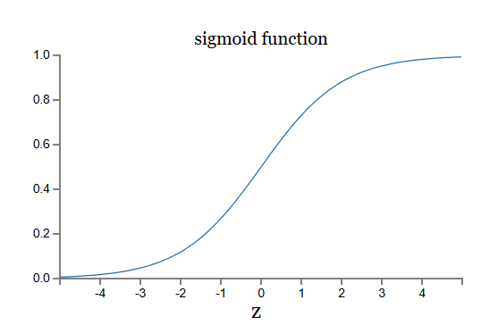

# Notes

This file contains notes from online book "[Neural Neural & Deep Learning](http://neuralnetworksanddeeplearning.com/index.html)" By [Michael Nielsen](https://michaelnielsen.org/)

### Types of Artificial Neurons

1. Perceptron
2. Sigmoid neuron

#### Perceptron

Perceptron takes binary inputs ($x_1, x_2,...$), calculates weighted sum ($z = x_1 * w_1 + x_2 * w_2 + ... + b$) & outputs binary value (0 or 1).

Perceptron outputs,

- **0** if $z <= 0$
- **1** if $z > 0$

**Weights** represents the importance of inputs ($x_1, x_2,...$).  
Example, to detect if patient is diabetic or non-diabetic, Glucose level is very important input value. So, glucose input as more weight (importance)

**bias** is like a measure of how easy it is to get the perceptron to output a 1.  
For a perceptron with a really big bias, it's extremely easy for the perceptron to output a 1
. But if the bias is very negative, then it's difficult for the perceptron to output a 1

---

#### Limitations of perceptron

To bring network (ANN) closer to desired behaviour (i.e outputs will be accurate), we need to make gradual changes to weights and bias, so the network's output changes gradually toward the desired output.

But,

perceptron uses a step function (discontinuous), so even a tiny change near the decision boundary can flip 0 → 1 or 1 → 0 abruptly.

Sigmoid fixes this because $σ$ is smooth and continuous, making the output change proportionally to weight changes.

---

#### Sigmoid neuron

**Sigmoid neuron** takes inputs that can be any real value (not just binary). It produces an output between 0 and 1 via the sigmoid function. (like 0.18, 0.73, 0.95..)

sigmoid function

$σ(z) = \frac{1}{ 1 + e^{-z}}$

When sigmoid neuron is used at final output layer to classify whether given input belongs to class 1 or not, then a convention can be applied like

- **Input belongs to class 1 if** $σ(z) >= 0.5$
- **Input NOT belongs to class 1 if** $σ(z) < 0.5$

The smoothness of $σ$
means that small changes $Δw$
in the weights and $Δb$
in the bias will produce a small change $Δoutput$
in the output from the neuron

That's why sigmoid neuron is used in ANNs

> [!Note]
> Other activation functions like ReLU or Tanh are also used as activation functions
