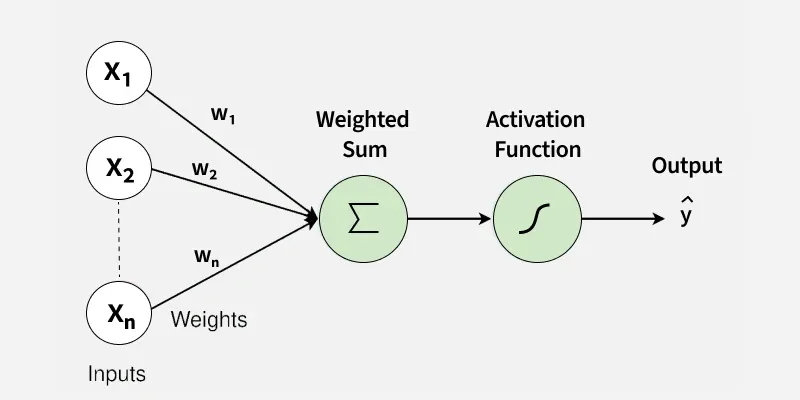
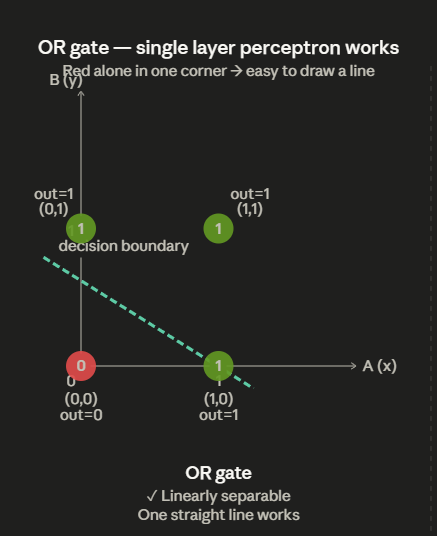
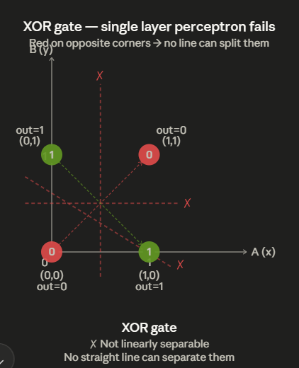

# Deep Learning

> [!Note]
> To better understand Neural network, read free online book [Neural network & Deep learning](http://neuralnetworksanddeeplearning.com/index.html). It is best resource.

**Deep learning** is technique to make machine learn from data using Artificial neural network.  
**_As machine learning uses ml algorithms to learn from data, deep learning uses Artificial Neural Network to learn from data._**

**_Artificial Neural Network (ANN) is foundational Machine learning algorithm/model which is inspired by the structure of the human brain._**

**Artificial Neural Network** are computational model that are similar to our human brain.  
**_ANNs consist of interconnected layers of nodes (neurons) that process data, learn from it, and make predictions._**


In simple terms, ANNs consist of layers of nodes: the input layer, where data is fed into the network; hidden layers, where data is processed and transformed; and the output layer, which produces the final result.

### Architecture of ANN

The architecture of an Artificial Neural Network (ANN) is typically divided into three primary layers -

1. **Input layer**: This layer receives raw data in the form of input features. Each neuron in the input layer represents a feature from the dataset (e.g., pixel values in an image or words in a text).

2. **Hidden layer**: These layers process the input data by performing a series of transformations. Each neuron in the hidden layers takes the weighted sum of the inputs from the previous layer, applies an activation function, and passes the result forward.

3. **Output Layer**: This layer produces the final prediction or classification. For example, in a classification task, the output might represent the probability of each class.

### How do ANNs learn

Artificial Neural Networks (ANNs) learn by adjusting the weights of connections between neurons based on the error between the predicted and actual outputs.

The learning process can be categorized into two main types:

#### Supervised Learning

- In supervised learning, ANNs are trained on labeled data.

- The network is given inputs along with the correct outputs (labels), and it learns by adjusting weights to minimize the difference between the predicted and actual outputs.

- The primary method for this is **backpropagation**, where the error is calculated at the output layer and propagated backward through the network to update the weights.

- This iterative process continues until the model reaches a desired level of accuracy.

#### Unsupervised Learning

- In unsupervised learning, ANNs are given data without labels.

- The goal is to find hidden patterns or representations within the data.

- The network learns to cluster or organize the data based on inherent similarities, without explicit feedback.

- Techniques like autoencoders are commonly used in unsupervised learning to compress data and learn useful feature representations.

#### Types of ANNs

- FNN (feedforward neural network)
- CNN (Convolutional neural network)
- RNN (Recurrent neural network)
- Autoencoders
- Transformers

## Perceptron

**A basic type of ANN is the Perceptron**.

**Perceptron** is one of the most earliest and fundamental ML algorithm that formed a foundation for neural networks & todays AI systems.

The **Perceptron model** is a type of **Artificial neuron** that functions as a **_linear binary classifier_**. Its purpose is to classify data points into one of two categories by learning a decision boundary from labeled training data.

### Components of Perceptron

- **Input layer**: The input layer consists of feature values or data points that the Perceptron will classify. Each input is assigned a corresponding weight.
- **Weights**: Weights determine the importance of each input in the classification process. The model adjusts these weights during training to improve accuracy.
- **Bias**: The bias term helps the Perceptron shift the decision boundary, improving flexibility in data classification.
- **Activation function**: The activation function, typically step function determines the output based on the weighted sum of the inputs.
- **Output**: The output is the final result of the Perceptron’s decision, typically a binary value (0 or 1) in the case of binary classification.

Together, these components allow the Perceptron to learn from data, adjust its parameters, and generate predictions.



### How Single layer Perceptron (SLP) works

The Perceptron model operates in a step-by-step process that involves computing the weighted sum of inputs, applying an activation function, and classifying the output.

1. **Initialize Weights and Bias**: At the beginning, perceptron initialize values of weights and bias (usually both as 0).

2. **Calculate Weighted sum**: It multiplies each input feature with its corresponding weights and sum them up. After that, adds bias to it to get weighted sum.

3. **Applies the Activation function**: Perceptron applies the activation function (Step function in this case) to the weighted sum, to get final prediction in binary form (0 or 1).

> [!Note]
> In a **_single-layer perceptron_**, a **step function** is typically used as the activation function, whereas in a **_multilayer perceptron_**, _non-linear activation functions_ such as **sigmoid** or **ReLU** are used.

4. **Update Weights and bias**: It compares predicted and actual value. If they are different, perceptron uses its learning rule to update weights and bias.

5. **Repeat**: Repeat the process until model converges.

#### How actually weights and bias are updated

Perceptron uses its **learning rule** to update weights and bias. **This weights and bias are updated as per the input feature values**.  
This means, next time, when similar type of input data points arrives, this updated weights and bias helps perceptron to output correct output.

Example, A perceptron is learning to classify whether given image is cat (1) or not cat (0)

So, initially weights and bias are initialized as 0.

Input layer takes first training input data point. Weighted sum is calculated and activation function is applied to output final prediction.

The actual outcome is 1 (cat), but perceptron predicts 0 (not a cat).

So, incorrect prediction, This is when learning rule is used to update weights and bias.

```
w = w + learning_rate × (actual - predicted) × input
b = b + learning_rate × (actual - predicted)
```

> [!Note]
> We can see, that learning rule formula contains `input`. This indicates that weights are adjusted as per input feature

Now, this weights and bias are updated in such a way, for new input data, it outputs 1 ( a cat) when similar input features are present.

Over many training samples, weights and bias gradually settle into values
where cat-like features consistently produce 1, and non-cat features
consistently produce 0.

> [!Note]
> In training, algorithm takes first data point, performs prediction,  
> If prediction matches actual output, then it goes for next data points with same weights and bias values,  
> Else updates weights and bias, and goes for next data points with this updated weights and bias.  
> This runs till data points ends  
> And this whole process is performed multiple times i.e epoch

> [!Note]
> Shuffle training data at each epoch to avoid overfitting to fixed order

---

### Single layer Perceptron with linearly separable data

Single layer perceptron can only draw **straight line decision boundary** to separate data points into two distinct classes.

If data is linearly separable, straight line easily separates them into two distinct classes. **_So, a single layer perceptron is sufficient for classification when data is linearly separable_**.

Example,

**Logic Gate like OR**: The data points can be separated by a single straight line.

| Input A | Input B | Output (Y) |
| :-----: | :-----: | :--------: |
|    0    |    0    |     0      |
|    0    |    1    |     1      |
|    1    |    0    |     1      |
|    1    |    1    |     1      |

**class 1**: (0,0) outputs 0  
**class 2**: (0,1) , (1,0) & (1,1) outputs 1



---

### Single layer Perceptron with non-linear data

**Single layer perceptron cannot work with non-linear data because non-linear data needs a curved decision boundary to separate data points into two distinct classes**.

Example,

**Logic gate like XOR**: It is mathematically impossible to separate XOR data points into distinct classes by using straight line.

| Input A | Input B | Output (A ⊕ B) |
| :-----: | :-----: | :------------: |
|    0    |    0    |       0        |
|    0    |    1    |       1        |
|    1    |    0    |       1        |
|    1    |    1    |       0        |

**class 1**: (0,0) & (1,1) outputs 0  
**class 2**: (0,1) & (1,0) outputs 1



---

> [!Note]
> Since most of real world data is non-linear, we need a model that can introduce non-linearity. This is where MLPs comes in picture. MLPs contains **hidden layers** and uses **non-linear activation function**.

---

### What Hidden layers does in MLPs

Hidden layers sit between the input and output layer. Each hidden layer looks at the output of the previous layer and learns to detect more abstract patterns from it.

For example,

- **Layer 1** — learns simple patterns from raw input (edges, basic shapes)

- **Layer 2** — combines simple patterns into something more meaningful (eyes, ears)

- **Layer 3** — combines those into higher concepts (a face, an object)

- **Output layer** — makes final decision based on all that built-up understanding

**Each Layer allows MLPs to find more complex non-linear relationships in input data**

---

### Why Non-linear activation function is important in MLPs

Without an activation function, each neuron just computes a weighted sum and passes it forward. That is a purely linear operation.

Stacking linear layers on top of each other is still linear. No matter how many layers you add, the whole network collapses into a single linear equation — making hidden layers pointless.

So, **The network can still only draw a straight line**.

**Non-linear activation functions** break this. After every weighted sum, the neuron passes the result through an activation function before sending it to the next layer. **This introduces a "bend" or "curve" into the computation**

Example, if we use **ReLU** (commonly used activation function)

This function -

- **outputs 0** when weighted sum is 0 or less than 0 (negative)
- **outputs same weighted sum value** when weighted sum is greater than 0

Example,

| Weighted sum | ReLU output |
| :----------: | :---------: |
|      -2      |      0      |
|      -5      |      0      |
|      0       |      0      |
|      3       |      3      |
|      7       |      7      |

**_this small non-linearity, applied across many neurons and many layers, allows the network to learn curved, complex decision boundaries_**

---

### Multi-layer Perceptron (MLP)

Multilayer Perceptron is an Artificial Neural Network (ANN) with an input layer, 1 or more hidden layers, and an output layer.
Each neuron in a layer is connected to every neuron in the next layer.

#### How data flows forward

Input layer takes input data. Each neuron in the input layer corresponds to a single feature.
For example, if data has 3 features, the input layer will have 3 neurons.

MLPs perform actual computation at hidden layers. Each neuron in a hidden layer:

- Calculates the weighted sum of its inputs
- Passes it through an activation function (typically ReLU, tanh, or sigmoid)
- Sends the output to the next layer as input

This continues layer by layer until the output layer.
The output layer also applies an activation function depending on the task:

- **Sigmoid** for binary classification
- **Softmax** for multi-class classification
- **No activation (linear)** for regression

The output layer then generates the final prediction.

#### How MLPs learn

After the prediction, it is compared with the actual value and error is calculated using a loss function:

- **MSE** for regression tasks
- **Binary Cross Entropy** for classification tasks

This error is then propagated backwards through the network layer by layer — this is called **Backpropagation**.
During backpropagation, the gradient of the loss is computed for each weight and bias.

Once all gradients are computed, the weights and biases are updated using **Gradient Descent**:

- Each weight is adjusted in the direction that reduces the error

**This full cycle — forward pass → loss calculation → backpropagation → weight update — repeats for many iterations until the loss is minimized.**

---
