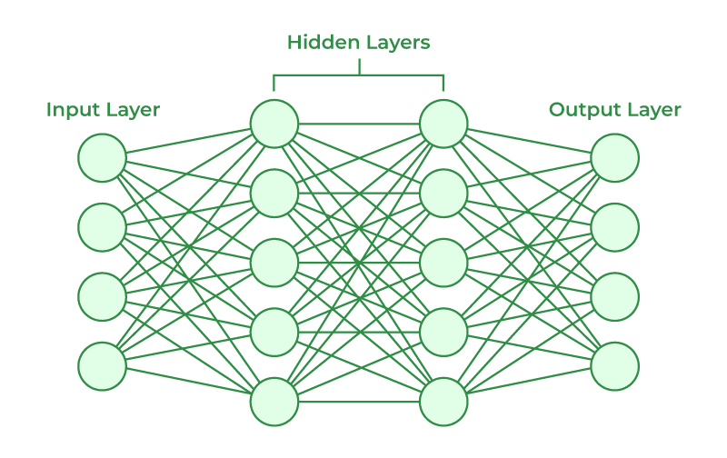

# Deep Learning

**Deep learning** is technique to make machine learn from data using artificial neural network.  
**_As machine learning uses ml algorithms to learn from data, deep learning uses Artificial Neural Network to learn from data._**

**Artificial Neural Network** are computational model that are similar to our human brain.  
**_ANNs consist of interconnected layers of nodes (neurons) that process data, learn from it, and make predictions._**

In simple terms, ANNs consist of layers of nodes: the input layer, where data is fed into the network; hidden layers, where data is processed and transformed; and the output layer, which produces the final result.

### Architecture of ANN

The architecture of an Artificial Neural Network (ANN) is typically divided into three primary layers -

1. **Input layer**: This layer receives raw data in the form of input features. Each neuron in the input layer represents a feature from the dataset (e.g., pixel values in an image or words in a text).

2. **Hidden layer**: These layers process the input data by performing a series of transformations. Each neuron in the hidden layers takes the weighted sum of the inputs from the previous layer, applies an activation function, and passes the result forward.

3. **Output Layer**: This layer produces the final prediction or classification. For example, in a classification task, the output might represent the probability of each class.

### How do ANNs learn

Artificial Neural Networks (ANNs) learn by adjusting the weights of connections between neurons based on the error between the predicted and actual outputs.

The learning process can be categorized into two main types:

#### Supervised Learning

- In supervised learning, ANNs are trained on labeled data.

- The network is given inputs along with the correct outputs (labels), and it learns by adjusting weights to minimize the difference between the predicted and actual outputs.

- The primary method for this is **backpropagation**, where the error is calculated at the output layer and propagated backward through the network to update the weights.

- This iterative process continues until the model reaches a desired level of accuracy.

#### Unsupervised Learning

- In unsupervised learning, ANNs are given data without labels.

- The goal is to find hidden patterns or representations within the data.

- The network learns to cluster or organize the data based on inherent similarities, without explicit feedback.

- Techniques like autoencoders are commonly used in unsupervised learning to compress data and learn useful feature representations.

#### Types of ANNs

- FNN (feedforward neural network)
- CNN (Convolutional neural network)
- RNN (Recurrent neural network)
- Autoencoders
- Transformers

## Perceptron

**Perceptron** is one of the most earliest and fundamental ML algorithm that formed a foundation for neural networks & todays AI systems.

The **Perceptron model** is a type of artificial neuron that functions as a **_linear binary classifier_**. Its purpose is to classify data points into one of two categories by learning a decision boundary from labeled training data.

### Components of Perceptron

- **Input layer**: The input layer consists of feature values or data points that the Perceptron will classify. Each input is assigned a corresponding weight.
- **Weights**: Weights determine the importance of each input in the classification process. The model adjusts these weights during training to improve accuracy.
- **Bias**: The bias term helps the Perceptron shift the decision boundary, improving flexibility in data classification.
- **Activation function**: The activation function, such as a step function or sigmoid function, determines the output based on the weighted sum of the inputs.
- **Output**: The output is the final result of the Perceptron’s decision, typically a binary value (0 or 1) in the case of binary classification.

Together, these components allow the Perceptron to learn from data, adjust its parameters, and generate predictions.  

### How Single layer Perceptron works

The Perceptron model operates in a step-by-step process that involves computing the weighted sum of inputs, applying an activation function, and classifying the output.

1. **Initialize Weights and Bias**: At the beginning, perceptron randomly initialize values of weights and bias (usually both as 0).
  
2. **Calculate Weighted sum**: It multiplies each input feature with its corresponding weights and sum them up. After that, adds bias to it to get weighted sum.

3. **Applies the Activation function**: Perceptron applies the activation function (Step function in this case) to the weighted sum, to get final prediction in binary form (0 or 1).

>[!Note]
> In a ***single-layer perceptron***, a **step function** is typically used as the activation function, whereas in a ***multilayer perceptron***, *non-linear activation functions* such as **sigmoid** or **ReLU** are used.

4. **Update Weights and bias**: It compares predicted and actual value. If they are different, perceptron uses its learning rule to update weights and bias.

5. **Repeat**: Repeat the process until model predicts correct outputs.
